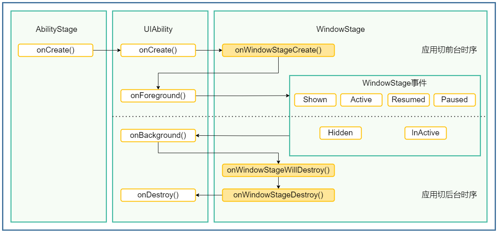

# Ability Kit

## UIAbility 组件

#### UIAbility 生命周期

Create、Foreground、Background、Destroy

#### UIAbility 启动模式
- singleton（单实例模式）

- multiton（多实例模式）

  multiton启动模式的开发使用，在module.json5配置文件中的launchType字段配置为multiton即可。
```json
{
  "module": {
    // ...
    "abilities": [
      {
        "launchType": "multiton",
        // ...
      }
    ]
  }
}
```
- specified（指定实例模式）

		1. 在SpecifiedAbility中，将[module.json5配置文件](https://developer.huawei.com/consumer/cn/doc/harmonyos-guides-V5/module-configuration-file-V5)的launchType字段配置为specified。
		1. 在创建UIAbility实例之前，开发者可以为该实例指定一个唯一的字符串Key，这样在调用[startAbility()](https://developer.huawei.com/consumer/cn/doc/harmonyos-references-V5/js-apis-inner-application-uiabilitycontext-V5#uiabilitycontextstartability)方法时，应用就可以根据指定的Key来识别响应请求的UIAbility实例。在EntryAbility中，调用[startAbility()](https://developer.huawei.com/consumer/cn/doc/harmonyos-references-V5/js-apis-inner-application-uiabilitycontext-V5#uiabilitycontextstartability)方法时，可以在[want](https://developer.huawei.com/consumer/cn/doc/harmonyos-references-V5/js-apis-app-ability-want-V5)参数中增加一个自定义参数，例如instanceKey，以此来区分不同的UIAbility实例。



#### UIAbility 上下文信息

- 在UIAbility中可以通过this.context获取UIAbility实例的上下文信息

```typescript
import { UIAbility, AbilityConstant, Want } from '@kit.AbilityKit';

export default class EntryAbility extends UIAbility {
  onCreate(want: Want, launchParam: AbilityConstant.LaunchParam): void {
    // 获取UIAbility实例的上下文
    let context = this.context;
    // ...
  }
}
```

- 在页面中获取UIAbility实例的上下文信息，包括导入依赖资源context模块和在组件中定义一个context变量两个部分。

```typescript
import { common, Want } from '@kit.AbilityKit';

@Entry
@Component
struct Page_EventHub {
  private context = getContext(this) as common.UIAbilityContext;

  startAbilityTest(): void {
    let want: Want = {
      // Want参数信息
    };
    this.context.startAbility(want);
  }

  // 页面展示
  build() {
    // ...
  }
}
```

也可以在导入依赖资源context模块后，在具体使用[UIAbilityContext](https://developer.huawei.com/consumer/cn/doc/harmonyos-references-V5/js-apis-inner-application-uiabilitycontext-V5)前进行变量定义。

```typescript
import { common, Want } from '@kit.AbilityKit';

@Entry
@Component
struct Page_UIAbilityComponentsBasicUsage {
  startAbilityTest(): void {
    let context = getContext(this) as common.UIAbilityContext;
    let want: Want = {
      // Want参数信息
    };
    context.startAbility(want);
  }

  // 页面展示
  build() {
    // ...
  }
}
```


#### UIAbility 数据同步

##### 使用EventHub进行数据通信

1. 在UIAbility中调用[eventHub.on()](https://developer.huawei.com/consumer/cn/doc/harmonyos-references-V5/js-apis-inner-application-eventhub-V5#eventhubon)方法注册一个自定义事件“event1”，eventHub.on()有如下两种调用方式

```typescript
import { UIAbility, Context, Want, AbilityConstant } from '@kit.AbilityKit';

export default class EntryAbility extends UIAbility {
  onCreate(want: Want, launchParam: AbilityConstant.LaunchParam): void {
    // 获取eventHub
    let eventhub = this.context.eventHub;
    // 执行订阅操作
    eventhub.on('event1', this.eventFunc);
    eventhub.on('event1', (data: string) => {
      // 触发事件，完成相应的业务操作
    });
  }

  eventFunc(argOne: Context, argTwo: Context): void {
    return;
  }
}
```

2. 在UI中通过[eventHub.emit()](https://developer.huawei.com/consumer/cn/doc/harmonyos-references-V5/js-apis-inner-application-eventhub-V5#eventhubemit)方法触发该事件，在触发事件的同时，根据需要传入参数信息。

```typescript
import { common } from '@kit.AbilityKit';
import { promptAction } from '@kit.ArkUI';

@Entry
@Component
struct Page_EventHub {
  private context = getContext(this) as common.UIAbilityContext;

  eventHubFunc(): void {
    // 不带参数触发自定义“event1”事件
    this.context.eventHub.emit('event1');
    // 带1个参数触发自定义“event1”事件
    this.context.eventHub.emit('event1', 1);
    // 带2个参数触发自定义“event1”事件
    this.context.eventHub.emit('event1', 2, 'test');
  }

  build() {
    Column() {
      Button('a').onClick(() => {
        this.eventHubFunc();
      })
      Button('b').onClick(() => {
        this.context.eventHub.off('event1');
      })
    }
  }
}
```

3. 在自定义事件“event1”使用完成后，可以根据需要调用[eventHub.off()](https://developer.huawei.com/consumer/cn/doc/harmonyos-references-V5/js-apis-inner-application-eventhub-V5#eventhuboff)方法取消该事件的订阅。

```typescript
import { UIAbility } from '@kit.AbilityKit';

export default class EntryAbility extends UIAbility {
  // ... 
  onDestroy(): void {
    this.context.eventHub.off('event1');
  }
}
```


##### 使用AppStorage/LocalStorage进行数据同步

ArkUI提供了[AppStorage](https://developer.huawei.com/consumer/cn/doc/harmonyos-guides-V5/arkts-appstorage-V5)和[LocalStorage](https://developer.huawei.com/consumer/cn/doc/harmonyos-guides-V5/arkts-localstorage-V5)两种应用级别的状态管理方案，可用于实现应用级别和[UIAbility](https://developer.huawei.com/consumer/cn/doc/harmonyos-references-V5/js-apis-app-ability-uiability-V5)级别的数据同步。其中，AppStorage是一个全局的状态管理器，适用于多个UIAbility共享同一状态数据的情况；而LocalStorage则是一个局部的状态管理器，适用于单个UIAbility内部使用的状态数据。