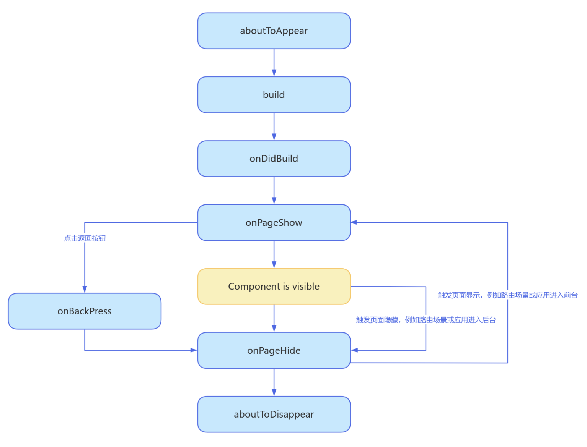

# ArkUI

## 声明周期

页面生命周期，即被@Entry装饰的组件生命周期，提供以下生命周期接口：

- [onPageShow](https://developer.huawei.com/consumer/cn/doc/harmonyos-references-V5/ts-custom-component-lifecycle-V5#onpageshow)：页面每次显示时触发一次，包括路由过程、应用进入前台等场景。
- [onPageHide](https://developer.huawei.com/consumer/cn/doc/harmonyos-references-V5/ts-custom-component-lifecycle-V5#onpagehide)：页面每次隐藏时触发一次，包括路由过程、应用进入后台等场景。
- [onBackPress](https://developer.huawei.com/consumer/cn/doc/harmonyos-references-V5/ts-custom-component-lifecycle-V5#onbackpress)：当用户点击返回按钮时触发。

组件生命周期，即一般用@Component装饰的自定义组件的生命周期，提供以下生命周期接口：

- [aboutToAppear](https://developer.huawei.com/consumer/cn/doc/harmonyos-references-V5/ts-custom-component-lifecycle-V5#abouttoappear)：组件即将出现时回调该接口，具体时机为在创建自定义组件的新实例后，在执行其build()函数之前执行。
- [onDidBuild](https://developer.huawei.com/consumer/cn/doc/harmonyos-references-V5/ts-custom-component-lifecycle-V5#ondidbuild12)：组件build()函数执行完成之后回调该接口，不建议在onDidBuild函数中更改状态变量、使用animateTo等功能，这可能会导致不稳定的UI表现。
- [aboutToDisappear](https://developer.huawei.com/consumer/cn/doc/harmonyos-references-V5/ts-custom-component-lifecycle-V5#abouttodisappear)：aboutToDisappear函数在自定义组件析构销毁之前执行。不允许在aboutToDisappear函数中改变状态变量，特别是@Link变量的修改可能会导致应用程序行为不稳定。

下图展示的是被@Entry装饰的组件（页面）生命周期。

