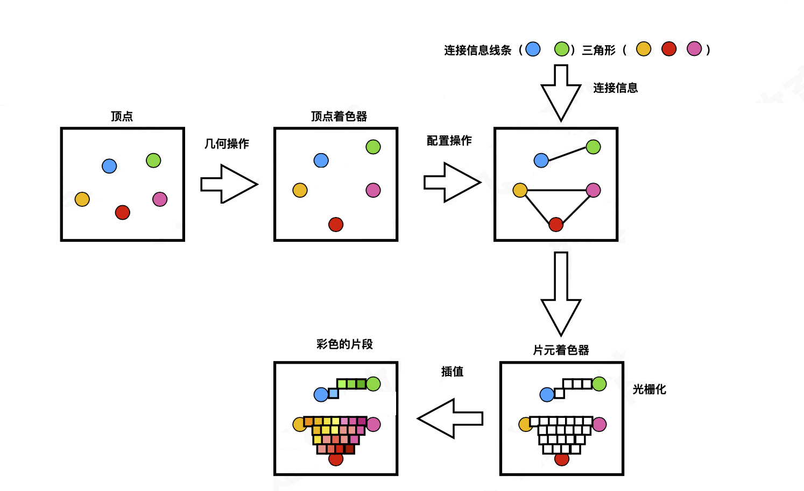

# GLSL

## GLSL 渲染图片

**着色器渲染过程**



**案例 shaderv.vsh 顶点着色器**

```objc
// 顶点坐标
attribute vec4 position; 
// 纹理坐标
attribute vec2 textCoordinate;
// 纹理坐标
varying lowp vec2 varyTextCoord;
void main() {
	// 通过 varying 修饰的 varyTextCoord, 将纹理坐标传递到片元着色器
	varyTextCoord = textCoordinate;
	// 给内建变量 gl_Position 赋值
	gl_Position = position;
}
```

**案例 shaderf.fsh 片元着色器**

```objc
// 纹理坐标
varying lowp vec2 varyTextCoord; 
// 纹理采样器（获取对应的纹理ID）
uniform sampler2D colorMap;
void main() {
	// texture2D(纹理采样器，纹理坐标)，获取对应坐标文素
  // gl_FragColor GLSL 内建变量(赋值像素点颜色值)
  // 纹理颜色添加对应像素点上。
	// gl_FragColor 内建变量. GLSL 语言已经提前定义好的变量。有相应的函数。
  // 内建函数。GLSL 语言提前封装好的相关函数。
  // 读取文素。vec4 texture2D(纹理colorMap, 纹理坐标varyTextCoord); rgba
	gl_FragColor = texture2D(colorMap, varyTextCoord);
}
```


**关于申请缓冲区标记**

```objc
// 申请一个缓冲区标志
// glGenRenderBuffers(1, &buffer);
// glGenFrameBuffers(1, &buffer);
glGenBuffers(1, &buffer);
```

**关于 GLSL 编译**

在 OpenGL ES 中，每个 `program` 对象有且仅有一个 `Vertex Shader` 对象和一个 `Fragment Shader` 对象连接到它。

- Shader：类似于C编译器
- Program：类似于C链接器
- glLinkProgram 操作产生最后的可执行程序，它包含最后可以在硬件上执行的硬件指令。

**Shader 和 Program 编程概述**

- 创建Shader
  - 编写 `Vertex Shader` 和 `Fragment Shader` 源码；
  - 创建两个 `shader` 实例：`glCreateShader`;
  - 给 `Shader` 实例指定源码。`glShaderSource`
  - 编译 `shader` 源码 `glCompileShader`
- 创建Program
  - 创建 **program** `glCreateProgram`
  - 绑定 **shader** 到 **program**。`glAttachShader(GLuint program, GLuint shader)`。每个 **program** 必须绑定一个 **Vertex Shader** 和一个 **Fragment Shader**。
  - 链接 **program**。 `glLinkProgram(GLuint program)`
  - 使用 **program**。`glUseProgram(GLuint program)`


## GLSL 加载几何图形

### GLSL 语法

- 变量和数据类型

  ```objc
  // 布尔型 true，false
  bool bDone = false;
  // 有符号整型数据
  int iValue = 42;
  // 无符号整型数据
  float fValue = 3.141592f;
  ```

- 向量数据类型

  ```objc
  // 向量声明-4分量的float类型向量
  vec4 v1;
  // 声明向量并且对其进行构造
  vec4 v2 = vec4(1,2,3,4);
  // 向量运算，加，赋值给另一个向量，与标量相乘
  vec4 v;
  vec4 vOldPos = vec4(1,2,3,4);
  vec4 vOffset = vec4(1,2,3,4);
  // 实例
  v = vOldPos + vOffset;
  v = vNewPos;
  v += vec4(10,10,10,10);
  v = vOldPos * vOffset;
  v *= 5;
  // 向量中元素的获取，可以通过 x,y,z,w 来获取向量中的元素
  v1.x = 3.0f;
  v1.xy = vec2(3.0f,4.0f);
  v1.xyz = vec3(3.0f,4.0f,5.0f);
  // 可以通过颜色控制 r,g,b,a
  v1.r = 3.0f;
  v1.rgba = vec4(1.0f,1.0f,1.0f);
  // 可以通过纹理坐标 s,t,p,q
  v1.st = vec2(1.0f,0.0f);
  // 赋值混合是否合法？不可以
  v1.st = v2.xt; // 不可以
  v1.st = v2.xy; // 可以，但没有开发意义，不属于行业规范
  // 向量支持调换（swizzle）操作，2个或者2个以上向量元素来进行交换
  v1.rgba = v2.bgra;
  v2.bgra = v1.rgba;
  // 赋值操作
  v1.r = v2.b;
  v1.g = v2.g;
  v1.b = v2.r;
  v1.a = v2.a;
  // 向量还支持一次性对所有分量操作
  v1.x = vOtherVerex.x + 5.0f;
  v1.y = vOtherVerex.y + 4.0f;
  v1.z = vOtherVerex.z + 3.0f;
  v1.xyz = vOtherVerex.xyz + vec3(5.0f,4.0f,3.0f);
  ```

- 矩阵

  ```objc
  // 创建矩阵
  mat4 m1,m2,m3;
  // 构造单元矩阵
  mat4 m2 = mat4(1.0f,0.0f,0.0f,0.0f,
                0.0f,1.0f,0.0f,0.0f,
                0.0f,0.0f,1.0f,0.0f,
                0.0f,0.0f,0.0f,1.0f);
  mat4 m4 = mat4(1.0f);
  mat4 m3 = mat4(0.5f,0.5f,0.5f,0.5f,
                0.5f,0.5f,0.5f,0.5f,
                0.5f,0.5f,0.5f,0.5f,
                0.5f,0.5f,0.5f,0.5f);
  // 
  m1 = m2 * m3;
  ```

- const

  ```objc
  const float zero = 0.0f;
  ```

- 结构体

  ```objc
  struct forStruct {
    vec4 color;
    float start;
    float end;
  }fogVar;
  fogVar = fogStruct(vec4(1.0,0.0,0.0,1.0),0.5,2.0);
  vec4 color = fogVar.color;
  float start = fogVar.start;
  ```

- 数组

  ```objc
  float floatArr[4];
  vec4 vecArr[2];
  // 注意
  float a[4] = float[](1.0,2.0,3.0,4.0);
  vec2 c[2] = vec2[2](vec2(1.0,2.0), vec2(3.0,4.0));
  ```

- 函数

  ```objc
  定义函数给3个修饰符
    in ：（没有指定时，默认限定修饰符），传递进入函数中，函数不能对其进行修改。
    inout ：（传入相应数值，并且可以在函数中进行修改）
    out ：（函数返回时，可以将其修改）
  ```

  ```objc
  vec4 myFunc(inout float myFloat, out vec4 m1, mat4 m2) {
    // 函数中计算
  }
  vec4 diffuse(vec3 normal, vec3 light, vec4 baseColor) {
    return baseColor * dot(normal, light);
  }
  // 注意：GLSL 函数中没有递归
  ```

- 控制语句

  ```objc
  if (color.a < 0.25) {
    color *= color.a;
  }else {
  	color = vec4(1.0,1.0,1.0,1.0);
  }
  // 循环只支持 while循环 / do...while... / for
  // 但是，OpenGL ES 开发中，尽量减轻逻辑判断，尽量降低循环迭代使用
  ```

  

  ###### 案例：GLSL 锥体绘制

  **shaderv.glsl**

  ```objc
  attribute vec4 position;
  attribute vec4 positionColor;
  uniform mat4 projectionMatrix;
  uniform mat4 modelViewMatrix;
  varying lowp vec4 varyColor;
  
  void main() {
      varyColor = positionColor;
      vec4 vPos;
      vPos = projectionMatrix * modelViewMatrix * position;
      gl_Position = vPos;
  }
  ```

  **shaderf.glsl**

  ```objc
  varying lowp vec4 varyColor;
  void main() {
      gl_FragColor = varyColor;
  }
  ```

  **View.m**

  ```objc
  #import "CCView.h"
  #import "GLESMath.h"
  #import "GLESUtils.h"
  #import <OpenGLES/ES2/gl.h>
  
  @interface View()
  
  @property (nonatomic, strong) CAEAGLLayer *myEagLayer;
  @property (nonatomic, strong) EAGLContext *myContext;
  
  @property (nonatomic, assign) GLuint myColorRenderBuffer;
  @property (nonatomic, assign) GLuint myColorFrameBuffer;
  
  @property (nonatomic, assign) GLuint myProgram;
  @property (nonatomic, assign) GLuint myVertices;
  
  @end
  
  @implementation View {
      float xDegree;
      float yDegree;
      float zDegree;
      BOOL bX;
      BOOL bY;
      BOOL bZ;
      NSTimer *myTimer;
  }
  
  - (void)layoutSubviews {
      //1.设置图层
      [self setupLayer];
      
      //2.设置上下文
      [self setupContext];
      
      //3.清空缓存区
      [self deletBuffer];
      
      //4.设置renderBuffer;
      [self setupRenderBuffer];
      
      //5.设置frameBuffer
      [self setupFrameBuffer];
      
      //6.绘制
      [self render];
  }
  
  //6.绘制
  - (void)render {
      //1.清屏颜色
      glClearColor(0, 0.0, 0, 1.0);
      glClear(GL_COLOR_BUFFER_BIT);
      
      
      CGFloat scale = [[UIScreen mainScreen] scale];
      //2.设置视口
      glViewport(self.frame.origin.x * scale, self.frame.origin.y * scale, self.frame.size.width * scale, self.frame.size.height * scale);
      
      //3.获取顶点着色程序、片元着色器程序文件位置
      NSString* vertFile = [[NSBundle mainBundle] pathForResource:@"shaderv" ofType:@"glsl"];
      NSString* fragFile = [[NSBundle mainBundle] pathForResource:@"shaderf" ofType:@"glsl"];
      
      //4.判断self.myProgram是否存在，存在则清空其文件
      if (self.myProgram) {
          
          glDeleteProgram(self.myProgram);
          self.myProgram = 0;
      }
      
      //5.加载程序到myProgram中来。
      self.myProgram = [self loadShader:vertFile frag:fragFile];
      
      //6.链接
      glLinkProgram(self.myProgram);
      GLint linkSuccess;
      
      //7.获取链接状态
      glGetProgramiv(self.myProgram, GL_LINK_STATUS, &linkSuccess);
      if (linkSuccess == GL_FALSE) {
          GLchar messages[256];
          glGetProgramInfoLog(self.myProgram, sizeof(messages), 0, &messages[0]);
          NSString *messageString = [NSString stringWithUTF8String:messages];
          NSLog(@"error%@", messageString);
          
          return ;
      }else {
          glUseProgram(self.myProgram);
      }
      
      //8.创建顶点数组 & 索引数组
      //(1)顶点数组 前3顶点值（x,y,z），后3位颜色值(RGB)
      GLfloat attrArr[] =
      {
          -0.5f, 0.5f, 0.0f,      1.0f, 0.0f, 1.0f, //左上0
          0.5f, 0.5f, 0.0f,       1.0f, 0.0f, 1.0f, //右上1
          -0.5f, -0.5f, 0.0f,     1.0f, 1.0f, 1.0f, //左下2
          
          0.5f, -0.5f, 0.0f,      1.0f, 1.0f, 1.0f, //右下3
          0.0f, 0.0f, 1.0f,       0.0f, 1.0f, 0.0f, //顶点4
      };
      
      //(2).索引数组
      GLuint indices[] =
      {
          0, 3, 2,
          0, 1, 3,
          0, 2, 4,
          0, 4, 1,
          2, 3, 4,
          1, 4, 3,
      };
      
      //(3).判断顶点缓存区是否为空，如果为空则申请一个缓存区标识符
      if (self.myVertices == 0) {
          glGenBuffers(1, &_myVertices);
      }
      
      
      //9.-----处理顶点数据-------
      //(1).将_myVertices绑定到GL_ARRAY_BUFFER标识符上
      glBindBuffer(GL_ARRAY_BUFFER, _myVertices);
      //(2).把顶点数据从CPU内存复制到GPU上
      glBufferData(GL_ARRAY_BUFFER, sizeof(attrArr), attrArr, GL_DYNAMIC_DRAW);
      
      //(3).将顶点数据通过myPrograme中的传递到顶点着色程序的position
      //1.glGetAttribLocation,用来获取vertex attribute的入口的.
      //2.告诉OpenGL ES,通过glEnableVertexAttribArray，
      //3.最后数据是通过glVertexAttribPointer传递过去的。
      //注意：第二参数字符串必须和shaderv.vsh中的输入变量：position保持一致
      GLuint position = glGetAttribLocation(self.myProgram, "position");
      
      //(4).打开position
      glEnableVertexAttribArray(position);
      
      //(5).设置读取方式
      //参数1：index,顶点数据的索引
      //参数2：size,每个顶点属性的组件数量，1，2，3，或者4.默认初始值是4.
      //参数3：type,数据中的每个组件的类型，常用的有GL_FLOAT,GL_BYTE,GL_SHORT。默认初始值为GL_FLOAT
      //参数4：normalized,固定点数据值是否应该归一化，或者直接转换为固定值。（GL_FALSE）
      //参数5：stride,连续顶点属性之间的偏移量，默认为0；
      //参数6：指定一个指针，指向数组中的第一个顶点属性的第一个组件。默认为0
      glVertexAttribPointer(position, 3, GL_FLOAT, GL_FALSE, sizeof(GLfloat) * 6, NULL);
      
      
      //10.--------处理顶点颜色值-------
      //(1).glGetAttribLocation,用来获取vertex attribute的入口的.
      //注意：第二参数字符串必须和shaderv.glsl中的输入变量：positionColor保持一致
      GLuint positionColor = glGetAttribLocation(self.myProgram, "positionColor");
     
      //(2).设置合适的格式从buffer里面读取数据
      glEnableVertexAttribArray(positionColor);
      
      //(3).设置读取方式
      //参数1：index,顶点数据的索引
      //参数2：size,每个顶点属性的组件数量，1，2，3，或者4.默认初始值是4.
      //参数3：type,数据中的每个组件的类型，常用的有GL_FLOAT,GL_BYTE,GL_SHORT。默认初始值为GL_FLOAT
      //参数4：normalized,固定点数据值是否应该归一化，或者直接转换为固定值。（GL_FALSE）
      //参数5：stride,连续顶点属性之间的偏移量，默认为0；
      //参数6：指定一个指针，指向数组中的第一个顶点属性的第一个组件。默认为0
      glVertexAttribPointer(positionColor, 3, GL_FLOAT, GL_FALSE, sizeof(GLfloat) * 6, (float *)NULL + 3);
  
      //11.找到myProgram中的projectionMatrix、modelViewMatrix 2个矩阵的地址。如果找到则返回地址，否则返回-1，表示没有找到2个对象。
      GLuint projectionMatrixSlot = glGetUniformLocation(self.myProgram, "projectionMatrix");
      GLuint modelViewMatrixSlot = glGetUniformLocation(self.myProgram, "modelViewMatrix");
      
      float width = self.frame.size.width;
      float height = self.frame.size.height;
      
      //12.创建4 * 4投影矩阵
      KSMatrix4 _projectionMatrix;
      //(1)获取单元矩阵
      ksMatrixLoadIdentity(&_projectionMatrix);
      //(2)计算纵横比例 = 长/宽
      float aspect = width / height; //长宽比
      //(3)获取透视矩阵
      /*
       参数1：矩阵
       参数2：视角，度数为单位
       参数3：纵横比
       参数4：近平面距离
       参数5：远平面距离
       参考PPT
       */
      ksPerspective(&_projectionMatrix, 30.0, aspect, 5.0f, 20.0f); //透视变换，视角30°
      //(4)将投影矩阵传递到顶点着色器
      /*
       void glUniformMatrix4fv(GLint location,  GLsizei count,  GLboolean transpose,  const GLfloat *value);
       参数列表：
       location:指要更改的uniform变量的位置
       count:更改矩阵的个数
       transpose:是否要转置矩阵，并将它作为uniform变量的值。必须为GL_FALSE
       value:执行count个元素的指针，用来更新指定uniform变量
       */
      glUniformMatrix4fv(projectionMatrixSlot, 1, GL_FALSE, (GLfloat*)&_projectionMatrix.m[0][0]);
      
  
      //13.创建一个4 * 4 矩阵，模型视图矩阵
      KSMatrix4 _modelViewMatrix;
      //(1)获取单元矩阵
      ksMatrixLoadIdentity(&_modelViewMatrix);
      //(2)平移，z轴平移-10
      ksTranslate(&_modelViewMatrix, 0.0, 0.0, -10.0);
      //(3)创建一个4 * 4 矩阵，旋转矩阵
      KSMatrix4 _rotationMatrix;
      //(4)初始化为单元矩阵
      ksMatrixLoadIdentity(&_rotationMatrix);
      //(5)旋转
      ksRotate(&_rotationMatrix, xDegree, 1.0, 0.0, 0.0); //绕X轴
      ksRotate(&_rotationMatrix, yDegree, 0.0, 1.0, 0.0); //绕Y轴
      ksRotate(&_rotationMatrix, zDegree, 0.0, 0.0, 1.0); //绕Z轴
      //(6)把变换矩阵相乘.将_modelViewMatrix矩阵与_rotationMatrix矩阵相乘，结合到模型视图
       ksMatrixMultiply(&_modelViewMatrix, &_rotationMatrix, &_modelViewMatrix);
      //(7)将模型视图矩阵传递到顶点着色器
      /*
       void glUniformMatrix4fv(GLint location,  GLsizei count,  GLboolean transpose,  const GLfloat *value);
       参数列表：
       location:指要更改的uniform变量的位置
       count:更改矩阵的个数
       transpose:是否要转置矩阵，并将它作为uniform变量的值。必须为GL_FALSE
       value:执行count个元素的指针，用来更新指定uniform变量
       */
      glUniformMatrix4fv(modelViewMatrixSlot, 1, GL_FALSE, (GLfloat*)&_modelViewMatrix.m[0][0]);
     
      //14.开启剔除操作效果
      glEnable(GL_CULL_FACE);
      
      //15.使用索引绘图
      /*
       void glDrawElements(GLenum mode,GLsizei count,GLenum type,const GLvoid * indices);
       参数列表：
       mode:要呈现的画图的模型 
                  GL_POINTS
                  GL_LINES
                  GL_LINE_LOOP
                  GL_LINE_STRIP
                  GL_TRIANGLES
                  GL_TRIANGLE_STRIP
                  GL_TRIANGLE_FAN
       count:绘图个数
       type:类型
               GL_BYTE
               GL_UNSIGNED_BYTE
               GL_SHORT
               GL_UNSIGNED_SHORT
               GL_INT
               GL_UNSIGNED_INT
       indices：绘制索引数组
  
       */
      glDrawElements(GL_TRIANGLES, sizeof(indices) / sizeof(indices[0]), GL_UNSIGNED_INT, indices);
      
      //16.要求本地窗口系统显示OpenGL ES渲染<目标>
      [self.myContext presentRenderbuffer:GL_RENDERBUFFER];
  }
  
  //5.设置frameBuffer
  - (void)setupFrameBuffer {
      //1.定义一个缓存区
      GLuint buffer;
      //2.申请一个缓存区标志
      glGenFramebuffers(1, &buffer);
      //3.
      self.myColorFrameBuffer = buffer;
      //4.设置当前的framebuffer
      glBindFramebuffer(GL_FRAMEBUFFER, self.myColorFrameBuffer);
      //5.将_myColorRenderBuffer 装配到GL_COLOR_ATTACHMENT0 附着点上
      glFramebufferRenderbuffer(GL_FRAMEBUFFER, GL_COLOR_ATTACHMENT0, GL_RENDERBUFFER, self.myColorRenderBuffer);
  }
  
  //4.设置renderBuffer
  - (void)setupRenderBuffer {
      //1.定义一个缓存区
      GLuint buffer;
      //2.申请一个缓存区标志
      glGenRenderbuffers(1, &buffer);
      //3.
      self.myColorRenderBuffer = buffer;
      //4.将标识符绑定到GL_RENDERBUFFER
      glBindRenderbuffer(GL_RENDERBUFFER, self.myColorRenderBuffer);
      [self.myContext renderbufferStorage:GL_RENDERBUFFER fromDrawable:self.myEagLayer];
  }
  
  //3.清空缓存区
  - (void)deletBuffer {
      glDeleteBuffers(1, &_myColorRenderBuffer);
      _myColorRenderBuffer = 0;
      
      glDeleteBuffers(1, &_myColorFrameBuffer);
      _myColorFrameBuffer = 0;
  }
  
  //2.设置上下文
  - (void)setupContext {
      EAGLRenderingAPI api = kEAGLRenderingAPIOpenGLES2;
      EAGLContext *context = [[EAGLContext alloc]initWithAPI:api];
      if (!context) {
          NSLog(@"Create Context Failed");
          return;
      }
      if (![EAGLContext setCurrentContext:context]) {
          NSLog(@"Set Current Context Failed");
          return;
      }
      self.myContext = context;
  }
  
  //1.设置图层
  - (void)setupLayer {
      self.myEagLayer = (CAEAGLLayer *)self.layer;
      [self setContentScaleFactor:[[UIScreen mainScreen]scale]];
      self.myEagLayer.opaque = YES;
      self.myEagLayer.drawableProperties = [NSDictionary dictionaryWithObjectsAndKeys:[NSNumber numberWithBool:NO], kEAGLDrawablePropertyRetainedBacking,kEAGLColorFormatRGBA8, kEAGLDrawablePropertyColorFormat, nil];
  }
  
  + (Class)layerClass {
      return [CAEAGLLayer class];
  }
  
  
  #pragma mark -- Shader
  - (GLuint)loadShader:(NSString *)vert frag:(NSString *)frag {
      //创建2个临时的变量，verShader,fragShader
      GLuint verShader,fragShader;
      //创建一个Program
      GLuint program = glCreateProgram();
      
      //编译文件
      //编译顶点着色程序、片元着色器程序
      //参数1：编译完存储的底层地址
      //参数2：编译的类型，GL_VERTEX_SHADER（顶点）、GL_FRAGMENT_SHADER(片元)
      //参数3：文件路径
      [self compileShader:&verShader type:GL_VERTEX_SHADER file:vert];
      [self compileShader:&fragShader type:GL_FRAGMENT_SHADER file:frag];
      
      //创建最终的程序
      glAttachShader(program, verShader);
      glAttachShader(program, fragShader);
      
      //释放不需要的shader
      glDeleteShader(verShader);
      glDeleteShader(fragShader);
      
      return program;
  }
  
  //链接shader
  - (void)compileShader:(GLuint *)shader type:(GLenum)type file:(NSString *)file {
       //读取文件路径字符串
      NSString *content = [NSString stringWithContentsOfFile:file encoding:NSUTF8StringEncoding error:nil];
      //获取文件路径字符串，C语言字符串
      const GLchar *source = (GLchar *)[content UTF8String];
      
      //创建一个shader（根据type类型）
      *shader = glCreateShader(type);
      
      //将顶点着色器源码附加到着色器对象上。
      //参数1：shader,要编译的着色器对象 *shader
      //参数2：numOfStrings,传递的源码字符串数量 1个
      //参数3：strings,着色器程序的源码（真正的着色器程序源码）
      //参数4：lenOfStrings,长度，具有每个字符串长度的数组，或NULL，这意味着字符串是NULL终止的
      glShaderSource(*shader, 1, &source, NULL);
      
      //把着色器源代码编译成目标代码
      glCompileShader(*shader);
  }
  
  #pragma mark - XYClick
  - (IBAction)XClick:(id)sender {
      //开启定时器
      if (!myTimer) {
          myTimer = [NSTimer scheduledTimerWithTimeInterval:0.05 target:self selector:@selector(reDegree) userInfo:nil repeats:YES];
      }
      //更新的是X还是Y
      bX = !bX;
  }
  - (IBAction)YClick:(id)sender {
      //开启定时器
      if (!myTimer) {
          myTimer = [NSTimer scheduledTimerWithTimeInterval:0.05 target:self selector:@selector(reDegree) userInfo:nil repeats:YES];
      }
      //更新的是X还是Y
      bY = !bY;
  }
  - (IBAction)ZClick:(id)sender {
      //开启定时器
      if (!myTimer) {
          myTimer = [NSTimer scheduledTimerWithTimeInterval:0.05 target:self selector:@selector(reDegree) userInfo:nil repeats:YES];
      }
      //更新的是X还是Y
      bZ = !bZ;
  }
  
  - (void)reDegree {
      //如果停止X轴旋转，X = 0则度数就停留在暂停前的度数.
      //更新度数
      xDegree += bX * 5;
      yDegree += bY * 5;
      zDegree += bZ * 5;
      //重新渲染
      [self render];
  }
  
  @end
  ```

  

  

  


