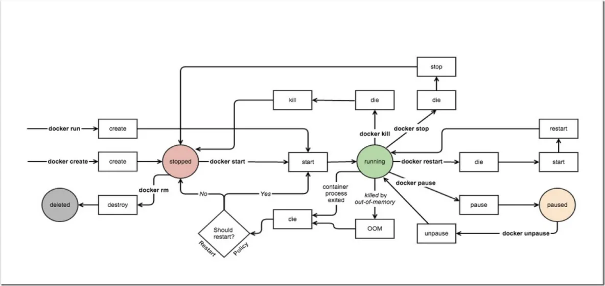
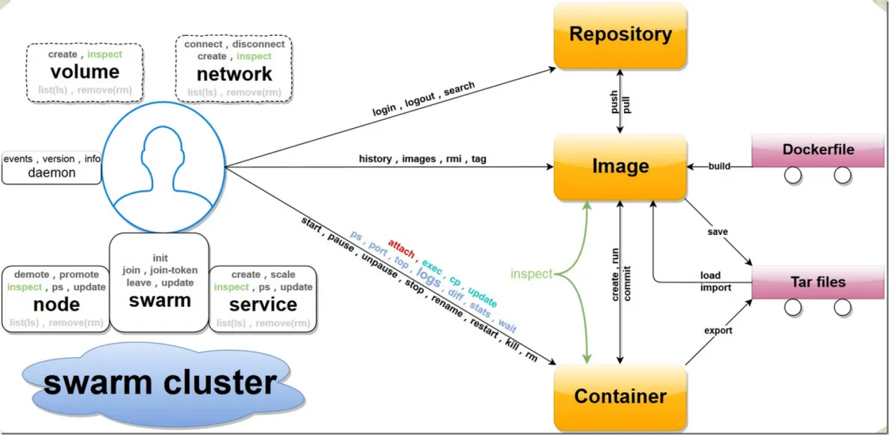

# docker 常规应用手册

一 、什么是 Docker

Docker 最初是 dotCloud 公司创始人 Solomon Hykes 在法国期间发起的一个公司内部项目，它是基于 dotCloud 公司多年云服务技术的一次革新，并于 2013 年 3月以 Apache 2.0 授权协议开源)，主要项目代码在 GitHub 上进行维护。Docker 项目后来还加入了 Linux 基金会，并成立推动开放容器联盟。其主要特点有：

源码开源，免费

使用 Google公司推出的 Go 语言进行开发实现

基于 Linux 内核技术，对进程进行封装隔离，属于操作系统层面的虚拟化技术

由于隔离的进程独立于宿主和其它的隔离的进程，因此也称其为容器

比虚拟机技术更为轻便、快捷：传统虚拟机技术是虚拟出一套硬件后，在其上运行一个完整操作系统，在该系统上再运行所需应用进程；而容器内的应用进程直接运行于宿主的内核，容器内没有自己的内核，而且也没有进行硬件虚拟。因此容器要比传统虚拟机更为轻便。

更高效的利用系统资源：由于容器不需要进行硬件虚拟以及运行完整操作系统等额外开销，Docker 对系统资源的利用率更高。无论是应用执行速度、内存损耗或者文件存储速度，都要比传统虚拟机技术更高效

更快速的启动时间：由于直接运行于宿主内核，无需启动完整的操作系统，因此可以做到秒级、甚至毫秒级的启动时间

一致的运行环境：Docker 的镜像提供了除内核外完整的运行时环境，确保了应用运行环境一致性，从而不会再出现 “这段代码在我机器上没问题啊” 这类问题。

持续交付和部署：Docker 可以通过定制应用镜像来实现持续集成、持续交付、部署。开发人员可以通过 Dockerfile 来进行镜像构建，并结合 持续集成(Continuous Integration) 系统进行集成测试，而运维人员则可以直接在生产环境中快速部署该镜像，甚至结合持续部署(Continuous Delivery/Deployment) 系统进行自动部署。

更轻松的迁移：Docker 可以在很多平台上运行，无论是物理机、虚拟机、公有云、私有云，甚至是笔记本，其运行结果是一致的。因此用户可以很轻易的将在一个平台上运行的应用，迁移到另一个平台上

更轻松的维护和扩展：Docker 使用的分层存储以及镜像的技术，使得应用重复部分的复用更为容易，也使得应用的维护更新更加简单，基于基础镜像进一步扩展镜像也变得非常简单。此外，Docker 团队同各个开源项目团队一起维护了一大批高质量的官方镜像，既可以直接在生产环境使用，又可以作为基础进一步定制，大大的降低了应用服务的镜像制作成本。

二、基本概念

Docker 包括三个基本概念    
镜像（Image）：相当于是一个含操作系统的完整的 root 文件系统。除了提供容器运行时所需的程序、库、资源、配置等文件外，还包含了一些为运行时准备的一些配置参数，镜像系统设计为分层存储的架构，由多层文件系统联合组成，镜像构建时，会一层层构建，前一层是后一层的基础。每一层构建完就不会再发生改变，后一层上的任何改变只发生在自己这一层。

容器（Container）：镜像是静态的定义，容器是镜像运行时的实体。容器可以被创建、启动、停止、删除、暂停等。容器的实质是进程，但与直接在宿主执行的进程不同，容器进程运行于属于自己的独立的 命名空间，每一个容器运行时，是以镜像为基础层，在其上创建一个当前容器的存储层，当容器消亡时，容器存储层也随之消亡。因此，任何保存于容器存储层的信息都会随容器删除而丢失。因此，所有的文件写入操作，都应该使用 数据卷（Volume）、或者绑定宿主目录，在这些位置的读写会跳过容器存储层，直接对宿主(或网络存储)发生读写，其性能和稳定性更高。数据卷的生存周期独立于容器，容器消亡，数据卷不会消亡。

仓库（Repository）：一个集中的存储、分发镜像的服务，Docker Registry就是这样的服务。一个 Docker Registry 中可以包含多个仓库（Repository）；每个仓库可以包含多个标签（Tag）；每个标签对应一个镜像。一个仓库包含的是同一个软件的不同版本的镜像，而标签则用于对应于软件的的不同版本。我们可以通过 <仓库名>:<标签> 的格式来指定具体是哪个版本的镜像。如果不给出标签，将以 latest 作为默认标签。例如：ubuntu:14.04 、 ubuntu:16.04来具体指定所需哪个版本的镜像，而ubuntu ，那将视为ubuntu:latest。

 

三、CentOS中的安装

使用yum源安装

yum –y install docker

使用官方安装脚本安装

curl -sSL  https://get.docker.com/ | sh

使用阿里云的安装脚本安装

curl -sSL  http://acs-public-mirror.oss-cn-hangzhou.aliyuncs.com/  docker-engine/internet | sh -

版本查询

docker -v

三、启动 Docker 引擎

systemctl enable docker

systemctl start docker

 

四、Docker compose项目

使用docker就不得不提Docker Compose，它是 Docker 官方编排（Orchestration）项目之一，负责快速在集群中部署分布式应用。它允许用户通过一个单独的 docker-compose.    
yml 模板文件（YAML 格式）来定义一组相关联的应用容器为一个项目（project）。就是说，你可以通过docker-compose.yml 模板文件来定义一个服务器集群，服务器集群中的每个服务器就是一个容器，可以配置多个容器之间的网络连接、端口，容器服务器名称、服务器中运行的镜像、服务器的环境配置、启动命令等。使用的镜像，可以手动拉取镜像，也可以自动以docker-compose.yml 构建环境后自动拉取。

Compose 中有两个重要的概念：

服务（service）：一个应用的容器，实际上可以包括若干运行相同镜像的容器实例。

项目(project)：由一组关联的应用容器组成的一个完整业务单元，在 dockercompose.yml 文件中定义。

五、Docker compose安装与卸载

Compose 目前支持 Linux 和 Mac OS 平台，两者的安装过程大同小异。安装 Compose 之前，要先安装 Docker（需要 Docker Engine 1.7.1+），Compose 可以通过 Python 的 pip 工具进行安装，可以直接下载编译好的二进制文件使用，甚至直接运行在 Docker 容器中。

1）首先安装epel扩展源：

sudo yum -y install epel-release

2）然后安装python-pip

sudo yum -y install python-pip

pip install docker-compose

3）版本查询

docker-compose –v

4）卸载

pip uninstall docker-compose

六、Docker 命令查询

Docker 命令有两大类，客户端命令和服务端命令。前者是主要的操作接口，后者用来启动 Docker daemon。

客户端命令：基本命令格式为  docker [OPTIONS] COMMAND [arg...] ；

服务端命令：基本命令格式为  docker daemon [OPTIONS] 。

可以通过 man docker 或 docker help 来查看这些命令。

1）服务端命令：docker daemon [OPTIONS] ，[OPTIONS] 的选项有：

--api-cors-header=""：CORS 头部域，默认不允许 CORS，要允许任意的跨域访问，可以指定为 “*”；  
--authorization-plugin=""：载入认证的插件；    
-b=""：将容器挂载到一个已存在的网桥上。指定为 'none' 时则禁用容器的网络，与 --bip 选项互斥；    
--bip=""：让动态创建的 docker0 网桥采用给定的 CIDR 地址; 与 -b 选项互斥；    
--cgroup-parent=""：指定 cgroup 的父组，默认 fs cgroup 驱动为/docker ，systemd cgroup 驱动为 system.slice ；    
--cluster-store=""：构成集群（如 Swarm）时，集群键值数据库服务地址；    
--cluster-advertise=""：构成集群时，自身的被访问地址，可以为host:port 或 interface:port ；    
--cluster-store-opt=""：构成集群时，键值数据库的配置选项；    
--config-file="/etc/docker/daemon.json"：daemon 配置文件路径；    
--containerd=""：containerd 文件的路径；    
-D, --debug=true|false：是否使用 Debug 模式。缺省为 false；    
--default-gateway=""：容器的 IPv4 网关地址，必须在网桥的子网段内；    
--default-gateway-v6=""：容器的 IPv6 网关地址；    
--default-ulimit=[]：默认的 ulimit 值；    
--disable-legacy-registry=true|false：是否允许访问旧版本的镜像仓库服务器；    
--dns=""：指定容器使用的 DNS 服务器地址；    
--dns-opt=""：DNS 选项；    
--dns-search=[]：DNS 搜索域；    
--exec-opt=[]：运行时的执行选项；    
--exec-root=""：容器执行状态文件的根路径，默认为 /var/run/docker ；    
--fixed-cidr=""：限定分配 IPv4 地址范围；    
--fixed-cidr-v6=""：限定分配 IPv6 地址范围；    
-G, --group=""：分配给 unix 套接字的组，默认为 docker ；    
-g, --graph=""：Docker 运行时的根路径，默认为 /var/lib/docker ；    
-H, --host=[]：指定命令对应 Docker daemon 的监听接口，可以为 unix 套接字（unix:///path/to/socket），文件句柄（fd://socketfd）或 tcp 套接字（tcp://[host[:port]]），默认为 unix:///var/run/docker.sock；    
--icc=true|false：是否启用容器间以及跟 daemon 所在主机的通信。默认为true。    
--insecure-registry=[]：允许访问给定的非安全仓库服务；    
--ip=""：绑定容器端口时候的默认 IP 地址。缺省为 0.0.0.0；    
--ip-forward=true|false：是否检查启动在 Docker 主机上的启用 IP 转发服务，默认开启。注意关闭该选项将不对系统转发能力进行任何检查修改；    
--ip-masq=true|false：是否进行地址伪装，用于容器访问外部网络，默认开启；    
--iptables=true|false：是否允许 Docker 添加 iptables 规则。缺省为 true；    
--ipv6=true|false：是否启用 IPv6 支持，默认关闭；

-l, --log-level="debug|info|warn|error|fatal"：指定日志输出级别；  
--label="[]"：添加指定的键值对标注；    
--log-driver="jsonfile|syslog|journald|gelf|fluentd|awslogs|splunk|etwlogs|gcplogs|none"：指定日志后端驱动，默认为 json-file；    
--log-opt=[]：日志后端的选项；    
--mtu=VALUE：指定容器网络的 mtu；    
-p=""：指定 daemon 的 PID 文件路径。缺省为 /var/run/docker.pid ；    
--raw-logs：输出原始，未加色彩的日志信息；    
--registry-mirror=://：指定 docker pull 时使用的注册服务器镜像地址；    
-s, --storage-driver=""：指定使用给定的存储后端；    
--selinux-enabled=true|false：是否启用 SELinux 支持。缺省值为 false。SELinux 目前尚不支持 overlay 存储驱动；    
--storage-opt=[]：驱动后端选项；    
--tls=true|false：是否对 Docker daemon 启用 TLS 安全机制，默认为否；    
--tlscacert= /.docker/ca.pem：TLS CA 签名的可信证书文件路径；    
--tlscert= /.docker/cert.pem：TLS 可信证书文件路径；    
--tlscert= /.docker/key.pem：TLS 密钥文件路径；    
--tlsverify=true|false：启用 TLS 校验，默认为否；    
--userland-proxy=true|false：是否使用用户态代理来实现容器间和出容器的回环通信，默认为 true；    
--userns-remap=default|uid:gid|user:group|user|uid：指定容器的用户命名空间，默认是创建新的 UID 和 GID 映射到容器内进程。

2）客户端命令：docker [OPTIONS] COMMAND [arg...] ；[OPTIONS] 的选项有：

--config=""：指定客户端配置文件，默认为 /.docker ；  
-D=true|false：是否使用 debug 模式。默认不开启；    
-H, --host=[]：指定命令对应 Docker daemon 的监听接口，可以为 unix 套接字（unix:///path/to/socket），文件句柄（fd://socketfd）或 tcp 套接字（tcp://[host[:port]]），默认为 unix:///var/run/docker.sock；    
-l, --log-level="debug|info|warn|error|fatal"：指定日志输出级别；    
--tls=true|false：是否对 Docker daemon 启用 TLS 安全机制，默认为否；    
--tlscacert= /.docker/ca.pem：TLS CA 签名的可信证书文件路径；    
--tlscert= /.docker/cert.pem：TLS 可信证书文件路径；    
--tlscert= /.docker/key.pem：TLS 密钥文件路径；    
--tlsverify=true|false：启用 TLS 校验，默认为否。

3）客户端命令：docker [OPTIONS] COMMAND [arg...] ；COMMAND的选项有：

可以使用：docker   COMMAND  --help 来查看每个命令的具体用法

attach：依附到一个正在运行的容器中；  
build：从一个 Dockerfile 创建一个镜像；    
commit：从一个容器的修改中创建一个新的镜像；    
cp：在容器和本地宿主系统之间复制文件中；    
create：创建一个新容器，但并不运行它；    
diff：检查一个容器内文件系统的修改，包括修改和增加；    
events：从服务端获取实时的事件；

exec：在运行的容器内执行命令；  
export：导出容器内容为一个 tar 包；    
history：显示一个镜像的历史信息；    
p_w_picpaths：列出存在的镜像；    
import：导入一个文件（典型为 tar 包）路径或目录来创建一个本地镜像；    
info：显示一些相关的系统信息；    
inspect：显示一个容器的具体配置信息；    
kill：关闭一个运行中的容器 (包括进程和所有相关资源)；    
load：从一个 tar 包中加载一个镜像；    
login：注册或登录到一个 Docker 的仓库服务器；    
logout：从 Docker 的仓库服务器登出；    
logs：获取容器的 log 信息；    
network：管理 Docker 的网络，包括查看、创建、删除、挂载、卸载等；    
node：管理 swarm 集群中的节点，包括查看、更新、删除、提升/取消管理节点等；    
pause：暂停一个容器中的所有进程；    
port：查找一个 nat 到一个私有网口的公共口；    
ps：列出主机上的容器；    
pull：从一个Docker的仓库服务器下拉一个镜像或仓库；    
push：将一个镜像或者仓库推送到一个 Docker 的注册服务器；    
rename：重命名一个容器；    
restart：重启一个运行中的容器；    
rm：删除给定的若干个容器；    
rmi：删除给定的若干个镜像；    
run：创建一个新容器，并在其中运行给定命令；    
save：保存一个镜像为 tar 包文件；    
search：在 Docker index 中搜索一个镜像；    
service：管理 Docker 所启动的应用服务，包括创建、更新、删除等；    
start：启动一个容器；    
stats：输出（一个或多个）容器的资源使用统计信息；    
stop：终止一个运行中的容器；    
swarm：管理 Docker swarm 集群，包括创建、加入、退出、更新等；    
tag：为一个镜像打标签；    
top：查看一个容器中的正在运行的进程信息；    
unpause：将一个容器内所有的进程从暂停状态中恢复；    
update：更新指定的若干容器的配置信息；

version：输出 Docker 的版本信息；  
volume：管理 Docker volume，包括查看、创建、删除等；    
wait：阻塞直到一个容器终止，然后输出它的退出符。

4）Docker 删除命令实例

a）删除一个容器

docker rm <containerID>

b）强制删除一个容器

docker rm -f <containerID>

c）强制删除全部容器

docker rm -f $(docker ps -aq)

d）删除一个镜像:

docker rmi <p_w_picpathID>

e）强制删除一个镜像:

docker rmi -f <p_w_picpathID>

f）强制删除全部镜像

docker rmi -f $(docker p_w_picpaths -q)

5）一张图总结 Docker 的命令

container事件状态图

Docker 命令分布图：

七、Docker Compose命令查询

对于 Compose 来说，大部分命令的对象既可以是项目本身，也可以指定为项目中的服务或者容器。如果没有特别的说明，命令对象将是项目，这意味着项目中所有的服务都会受到命令影响。执行 docker-compose [COMMAND] --help 或者 docker-compose help [COMMAND] 可以查看具体某个命令的使用格式。

Compose 命令的基本的使用格式是:

docker-compose [-f=<arg>...] [options] [COMMAND] [ARGS...]

[options] 选项:

-f, --file FILE 指定使用的 Compose 模板文件，默认为 dockercompose.yml ，可以多次指定。  
-p, --project-name NAME 指定项目名称，默认将使用所在目录名称作为项目名。    
--x-networking 使用 Docker 的可拔插网络后端特性（需要 Docker 1.9 及以后版本）。    
--x-network-driver DRIVER 指定网络后端的驱动，默认为 bridge （需要 Docker 1.9 及以后版本）。    
--verbose 输出更多调试信息。    
-v, --version 打印版本并退出。

[COMMAND] 选项:

1）build：格式为 docker-compose build [options] [SERVICE...]

构建（重新构建）项目中的服务容器。服务容器一旦构建后，将会带上一个标记名，例如对于 web 项目中的一个 db 容器，可能是 web_db。可以随时在项目目录下运行 docker-compose build 来重新构建服务。

它的[options] 选项包括：

--force-rm 删除构建过程中的临时容器。  
--no-cache 构建镜像过程中不使用 cache（这将加长构建过程）。    
--pull 始终尝试通过 pull 来获取更新版本的镜像。

2）kill：格式为 docker-compose kill [options] [SERVICE...]

通过发送 SIGKILL 信号来强制停止服务容器。支持通过 -s 参数来指定发送的信号，例如通过如下指令发送 SIGINT 信号：docker-compose kill -s SIGINT

3）logs：格式为 docker-compose logs [options] [SERVICE...]

查看服务容器的输出。默认情况下，docker-compose 将对不同的服务输出使用不同的颜色来区分。可以通过 --no-color 来关闭颜色。该命令在调试问题的时候十分有用。

4）pause：格式为 docker-compose pause [SERVICE...]    
暂停一个服务容器。

5）port：格式为 docker-compose port [options] SERVICE PRIVATE_PORT    
打印某个容器端口所映射的公共端口。    
[options] 选项：    
--protocol=proto 指定端口协议，tcp（默认值）或者 udp。    
--index=index 如果同一服务存在多个容器，指定命令对象容器的序号（默认为 1）。

6）ps：格式为 docker-compose ps [options] [SERVICE...]    
列出项目中目前的所有容器。

选项：  
-q 只打印容器的 ID 信息。

7）pull：格式为 docker-compose pull [options] [SERVICE...]    
拉取服务依赖的镜像。    
选项：    
--ignore-pull-failures 忽略拉取镜像过程中的错误。

8）restart：格式为 docker-compose restart [options] [SERVICE...]    
重启项目中的服务。    
选项：    
-t, --timeout TIMEOUT 指定重启前停止容器的超时（默认为 10 秒）。

9）rm：格式为 docker-compose rm [options] [SERVICE...]

删除所有（停止状态的）服务容器。推荐先执行 docker-compose stop 命令来停止容器。  
选项：    
-f, --force 强制直接删除，包括非停止状态的容器。一般尽量不要使用该选项。    
-v 删除容器所挂载的数据卷。

10）run：格式为 docker-compose run [options] [-p PORT...] [-e KEY=VAL...] SERVICE [COMMAND] [ARGS...]    
在指定服务上执行一个命令。    
例如：    
$ docker-compose run ubuntu ping docker.com

将会启动一个 ubuntu 服务容器，并执行 ping docker.com 命令。

默认情况下，如果存在关联，则所有关联的服务将会自动被启动，除非这些服务已经在运行中。  
该命令类似启动容器后运行指定的命令，相关卷、链接等等都将会按照配置自动创建。    
两个不同点：

给定命令将会覆盖原有的自动运行命令；

不会自动创建端口，以避免冲突。

如果不希望自动启动关联的容器，可以使用 --no-deps 选项，例如

$ docker-compose run --no-deps web python manage.py shell  
将不会启动 web 容器所关联的其它容器。    
[options] 选项：

-d 后台运行容器。  
--name NAME 为容器指定一个名字。    
--entrypoint CMD 覆盖默认的容器启动指令。    
-e KEY=VAL 设置环境变量值，可多次使用选项来设置多个环境变量。    
-u, --user="" 指定运行容器的用户名或者 uid。    
--no-deps 不自动启动关联的服务容器。    
--rm 运行命令后自动删除容器， d 模式下将忽略。    
-p, --publish=[] 映射容器端口到本地主机。    
--service-ports 配置服务端口并映射到本地主机。    
-T 不分配伪 tty，意味着依赖 tty 的指令将无法运行。

11）scale：格式为 docker-compose scale [options] [SERVICE=NUM...]    
设置指定服务运行的容器个数。通过 service=num 的参数来设置数量。例如：    
$ docker-compose scale web=3 db=2    
将启动 3 个容器运行 web 服务，2 个容器运行 db 服务。一般的，当指定数目多于该服务当前实际运行容器，将新创建并启动容器；反之，停止容器。    
选项：    
-t, --timeout TIMEOUT 停止容器时候的超时（默认为 10 秒）。

12）start：格式为 docker-compose start [SERVICE...]    
启动已经存在的服务容器。

13）stop：格式为 docker-compose stop [options] [SERVICE...]

停止已经处于运行状态的容器，但不删除它。通过 docker-compose start 可以再次启动这些容器。  
选项：    
-t, --timeout TIMEOUT 停止容器时候的超时（默认为 10 秒）。

14）unpause：格式为 docker-compose unpause [SERVICE...] 。    
恢复处于暂停状态中的服务。

15）up：格式为 docker-compose up [options] [SERVICE...] 。    
该命令十分强大，它将尝试自动完成包括构建镜像，（重新）创建服务，启动服务，并关联服务相关容器的一系列操作。    
链接的服务都将会被自动启动，除非已经处于运行状态。可以说，大部分时候都可以直接通过该命令来启动一个项目。    
默认情况， docker-compose up 启动的容器都在前台，控制台将会同时打印所有容器的输出信息，可以很方便进行调试。当通过 Ctrl-C 停止命令时，所有容器将会停止。    
如果使用 docker-compose up -d ，将会在后台启动并运行所有的容器。一般推荐生产环境下使用该选项。    
默认情况，如果服务容器已经存在， docker-compose up 将会尝试停止容器，然后重新创建（保持使用 volumes-from 挂载的卷），以保证新启动的服务匹配docker-compose.yml 文件的最新内容。如果用户不希望容器被停止并重新创建，可以使用 docker-compose up --no-recreate 。这样将只会启动处于停止状态的容器，而忽略已经运行的服务。如果用户只想重新部署某个服务，可以使用docker-compose up --no-deps -d <SERVICE_NAME> 来重新创建服务并后台停止旧服务，启动新服务，并不会影响到其所依赖的服务。

[options] 选项：    
-d 在后台运行服务容器。

--no-color 不使用颜色来区分不同的服务的控制台输出。  
--no-deps 不启动服务所链接的容器。    
--force-recreate 强制重新创建容器，不能与 --no-recreate 同时使用。    
--no-recreate 如果容器已经存在了，则不重新创建，不能与 --forcerecreate同时使用。    
--no-build 不自动构建缺失的服务镜像。    
-t, --timeout TIMEOUT 停止容器时候的超时（默认为 10 秒）。

16）migrate-to-labels：格式为 docker-compose migrate-to-labels 。    
重新创建容器，并添加 label。    
主要用于升级 1.2 及更早版本中创建的容器，添加缺失的容器标签。实际上，最彻底的办法当然是删除项目，然后重新创建。    
17）version：格式为 docker-compose version 。    
打印版本信息。

