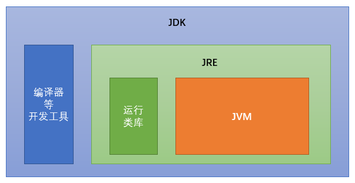

# Java 概述

Java 语言是美国 Sun 公司（Stanford University Network），在1995年推出的高级编程语言。


## Java 开发环境

#### Java 虚拟机-JVM

- **JVM**（Java Virtual Machine）：Java虚拟机，简称 JVM，是运行所有 Java 程序的假象计算机，是 Java 程序的运行环境，是 Java 最具吸引力的特性之一。编写的 Java 代码，都是运行在 JVM 之上。
- **跨平台**：任何软件的运行，都必须要运行在操作系统之上，而用 Java 编写的软件可以运行在任何的操作系统上，这个特性称为 Java 语言的跨平台特性。该特性是 JVM 实现的，我们编写的程序运行在 JVM上，而 JVM 运行在操作系统上。

#### JRE 和 JDK

- **JRE**（Java Runtime Environment）：是 Java 程序的运行环境，包含 JVM 和运行时所需要的 **核心类库**。
- **JDK**（Java Development Kit）：是 Java 程序开发工具包，包含 JRE 和开发人员使用的工具。

想要运行一个已有的 Java 程序，那么只需安装 JRE 即可。
想要开发一个全新的 Java 程序，那么必须安装 JDK 。

> 三者关系：JDK > JRE > JVM




## Java 开发步骤

**编写、编译、运行**

#### 编写 Java 源文件

在指定目录下新建文本文件 `HelloWorld.java` ，用文本编辑软件打开并编辑：

```java
public class HelloWorld {
	public static void main(String[] args) {
		System.out.println("Hello World!"); 
  }
}
```

> 文件名必须是 HelloWorld ，保证文件名和类的名字是一致的，注意大小写。

#### 编译 Java 源文件

**编译**：是指将编写的 Java 源文件翻译成 JVM 认识的 class 文件，在这个过程中， javac 编译器会检查所写的程序是否有错误，有错误就会提示出来，如果没有错误就会编译成功。

```cmd
javac Java源文件名.后缀名
```

```cmd
javac HelloWorld.java
```

编译成功后会产生一个新文件 `HelloWorld.class`，该 **字节码文件** 就是 Java 可运行的文件。

#### 运行 Java 程序

**运行**：是指将 class 文件交给 JVM 去运行，此时 JVM 就会去执行我们编写的程序了。

```cmd
java 类名字
```

```cmd
java HelloWorld
```

