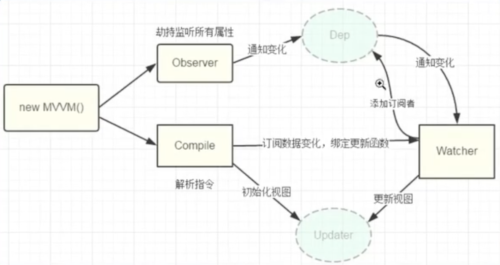

# Vue


## Vue 生命周期

1. 创建
2. 初始化数据
3. 编译template
4. 挂载DOM
5. 渲染
6. 更新渲染
7. 卸载

- beforeCreate：实例创建之初
- created：组件已经创建完成 异步请求获取 dom并没有生成
- beforeMount：组件挂在前
- mounted：组件挂载之后 异步请求获取 会导致 dom 更新 页面变化，有可能导致页面闪动
- beforeUpdate：数据发生变化 组件更新之前
- updated：数据发生变化组件更新后
- beforeDestroy：实例销毁前
- destroyed：实例销毁后
- activated：keep-alive 组件激活
- deactivated：keep-alive 组件停用
- errorCaptured：捕获实例的错误

具体解析：

```js
new Vue() const vm = Vue() {} // 创建空的实例对象
init events lifecycle // 注入：事件处理方法 生命周期
// beforeCreate 
init reactivity data injection methods // 初始化响应式、属性、方法
// created
判断是否有 option 属性
	- true // 有，直接往下走
	- false => el option vm.$mount(el) // 
判断是否有 template 属性
	- true // 编译 template 语言
	- false // 编译 element outerHTML 转换成 template 语言
// beforeMount // 此时模版已经编译好了，但是页面未更新
vm.$el replate $el // 将页面元素和模板做替换
// mounted // 在DOM上的渲染已经完成
// beforeUpdate // 收集需要更新的数据
VDOM re-render patch // 虚拟DOM 重新 re-render patch
// updated
// beforeDestroy // 需要销毁的时候
data methods filter directive 数据还都是可用的
// destroyed // 组件销毁
```


## 双向数据绑定

1. 数据层 model：存储数据及业务逻辑
2. 视图层 view：展示效果
3. 业务逻辑层 viewModel：数据 视图 绑定

MVVM  model  viewModel  view

viewModel 解析成两部分：

1. observer：对所有数据的属性进行监听
2. compiler：解析器，扫描节点，解析生效，更新

```js
new Vue()

1. data Observer // 对data做响应式处理
2. template 动态绑定数据 {{}} > data获取 view关联 compiler
3. update watcher 
4. data dep -> watcher -> update
```

```js
1. new MVVM()
2. Observer: 劫持监听所有的属性，通知变化 Dep -> Watcher -> Update 视图更新
3. Compiler：订阅js数据变化，绑定到 Watcher，
```



1. defineReactive key Dep
2. key name1 node watcher
3. name1 getter watcher name1 中的 Dep
4. name1 setter Dep -> watcher


## 双向收集是如何实现的

```js
依赖
<p>{{ name1 }}</p>
<p>{{ name2 }}</p>
<p>{{ name3 }}</p>

根据依赖绑定key，然后创建对应的watcher监听 
key = name1 Watcher1
key = name2 Watcher2
key = name3 Watcher3

创建 Dep 管理 Watcher
Dep1 deps = [Watcher1, Watcher3]
Dep2 deps = [Watcher2]
```

1. defineReactive  为key创建Dep实例
2. key = name1 Watcher1
3. Getter name1 Watcher1添加name1的Deps
4. setter Deps 通知Watcher进行更新


## Vue 组件通信方式

父子组件通信 

兄弟组件通信

祖孙 后台 通信

非关系组件通信


#### props

父 传 子

```vue
<Children name='aaa' age=18>

// children
props: {
	name: String,
  age: {
    require: true,
    default: 18,
    type: Number
  }
}
```

#### $emit

子组件向父组件传值

```js
this.$emit('add', 123)

<Children @add='addEvent($event)'
```

#### ref

```js
<Children ref="foo" />
  
this.$refs.foo // 获取到子组件中的实例
```

#### EventBus

兄弟组件传值

创建事件总线

```js
class Bus {
  constructor() {
    this.callbacks = {}; // 存放事件名称
  }
  
  $on(name, fn) {
    this.callbacks[name] = this.callbacks[name] || []
    this.callbacks[name].push(fn)
  }
 	
  $emit(name, args) [
    if (this.callbacks[name]) {
      this.callbacks[name].forEach(cb => cb(args))
    }
  ]
}
// 绑定
Vue.prototype.$bus = new Bus()
// 触发方法
this.$bus.$emit('foo')
// 接收消息，触发自己的handle方法
this.$bus.$on('foo', this.handle)
```

#### parent root

适用于 有共同祖先的 比如两个兄弟组件

```js
// 一个组件监听
this.$parent.on('add', this.add)
// 一个组件触发
this.$parent.emit('add')
```

#### attrs / listeners

祖先传递给子孙，批量向下传递

```js
// child 没有在props中申明foo
<p>{{ $attrs.foo }}</p>

<Child foo='foo'>
  
// 隔代传递
<Child2 msg='hello' @some-event="onSomeEvent"></Child2>

<Grandson v-bind"$attrs" v-on="$listeners"></Grandson>
	// Grandson.vue
	<div @click="$emit('some-event', 'msg from grandson')"></dev>
```

#### provide / inject

祖先传递给子孙，批量向下传递，这种方式更好

```js
// 父组件申明属性
provide() {
  return {
    foo: 'foo'
  }
}

// 后代组件就可以获取到对应属性值了
inject: ['foo']
```

#### vuex

比较复杂的组件传递数据，没有任何关联的传值


## data 的属性是一个函数 而不是一个对象

保持组件数据的独立性。

在 initData 的时候，vue 会将函数内容实例化成新的对象，避免多组件数据冲突。


## v-if 、v-for

v-if：条件式的渲染

v-for：item in items，key，迭代式渲染

v-if 和 v-for 不要放在同一个元素上，避免性能浪费。（在同一层级的话，v-for 渲染优先级 高于 v-if ）

1. 在外层使用v-if 判断，内部 v-for 渲染
2. 在 computed 中提前过滤不需要显示的内容


## v-show 、 v-if

区别：

1. 控制手段

   v-show：在 css 中添加了 display：none，dom还在；

   v-if：dom 真实控制是否存在

2. 编译过程

​		v-if：局部编辑/卸载  

​		v-show：css切换

3. 编译条件

   v-show：false true 不会触发组件的生命周期

   v-if：false ture 会触发完整的生命周期 


## key

提升 diff 效率

```js
a b c d e
a b f c d e
在ab后插入f的情况

没有key：
	3次更新，1次插入（更新c d e， 插入e）
有key：
	一次插入（插入f）
```


## mixin

混入，提供了方法的实现，其他类中可以直接访问mixin类中的方法，但不需要成为其子类。

实现功能模块的完整植入。

灵活可服用的方式。

#### 两种混入方式：

1. 局部混入

```js
const customMixin = {
  created: function() {
    this.hello()
  }
  methods: {
  	hello: function() {
      console.log('hello')
    }
	}
}

Vue.component('componentA', {
  mixin: [customMixin]
})
```

2. 全局混入

```js
Vue.mixin({
  created: function() {
    console.log('global mixin')
  }
})
```


#### 使用场景

封装可服用性的功能

```js
const Modal = {
  template: '#Modal',
  data() {
    return {
      isShowing: false
    }
  },
  methods: {
  	toggleShow() {
      this.isShowing = !this.isShowing
    } 
  }
}
```

 ```js
 const Tooltip = {
   template: '#Tooltip',
   data() {
     return {
       isShowing: false
     }
   },
   methods: {
   	toggleShow() {
       this.isShowing = !this.isShowing
     } 
   }
 }
 ```

上面的代码使用混入改写如下：

```js
const toggle = {
  data() {
    return {
      isShowing: false
    }
  },
  methods: {
    toggleShow() {
      this.isShowing = !this.isShowing
    }
  }
}
```

```js
const Modal = {
  template: '#Modal',
  mixin: [toggle]
}
```

```js
const Tooltip = {
  template: '#Tooltip',
  mixin: [toggle]
}
```

#### 源码解析

替换策略

```js
strats.props = 
strats.methods = 
strats.inject = 
strats.computed = function(
	...
) : ?Object{
	...
}
strats.provide = mergeDataOrFn
```

合并策略

```js
strats.data = 
...
```

叠加型

```js
strats.components = 
strats.directives = 
strats.filters = function jmergeAssets(
		parentVal, childVal, vm, key
) {
  	...
}
```


## vue 修饰符

限定类型，或限定类型成员的一种符号

1. 表单修饰符

   lazy、trim、number

```js

lazy: 光标移出去的时候才生效
<input type="text" v-mode.lazy="value">
<p>{{ value }}</p>
```

```js
trim：过滤首尾空格
number：数字
```

2. 事件修饰符

   stop prevent self once native

```js
stop: 阻止事件冒泡
prevent: preventDefault
self: 只有绑定事件是当前自身的才会触发
once: 只会触发一次
native: 只会向html一样绑定自身的元素
```

3. 鼠标修饰符

​		left right middle

```js
判断鼠标点击的 左键 右键 中间键
```

4. 键盘修饰符

​		onKeyup  onKeydown

​		keyCode  enter  tab  space  esc  up  down

```js
<input type="text" @keyup.enter="enterEvent">
```


## nextTick

在DOM更新循环后执行延迟回调，在回调中能够获取最新的DOM

Vue 更新 DOM 是异步的操作，DOM发生变化，执行异步更新队列，等所有数据变更完再去更新。

使用场景：

 ```js
 vm.message = 'changed val'
 
 console.log(vm.$el.textContent) // init val
 
 Vue.nextTick(() => {
   console.log(vm.$el.textContent) // changed val
 })
 ```

```js
this.message = 'changed val'

console.log(vm.$el.textContent) // init val

Vue.nextTick(() => {
  console.log(this.$el.textContent) // changed val
})
```

主动调用 nextTick

```js
await this.$nextTick()
```


## Vue 组件 & 插件

- 组件

1. 降低系统的耦合度
2. 调试更方便
3. 提升可维护性


- 插件

为 Vue 添加的全局功能

1. 添加全局的方法或者属性 vue-custom-element
2. 添加全局资源 vue-touch
3. 全局混入 vue-router
4. 添加原型方法 Vue.prototype.xxx 


## Vue 过滤器的基本使用

```js
{{ message | capitcalize }}
 filters: {
   capitcalize: function(val) {
     if (!val) return ''
     return 'xxx'
   }
 }

Vue.filter('capitcalize', function(val) {
  
})

new Vue()
```

```js
{{ message | filterA | filterB }}
```


## Vue 自定义指令

系统指令：v-show  v-model

`v-xxx`="value"

```js
Vue.directive

// 全局使用
Vue.directive('focus', {
  inserted: function(el) {
    el.focus()
  }
})

// 在组件中使用
directives: {
  focus: {
    inserted: founction(el) {
      el.focus()
    }
  }
}

<input v-focus>
```

钩子：

1. bind：在初始阶段一次性配置
2. inserted：当元素绑定到父节点
3. update：Vnode update
4. componentUpdated：Vnode 当前节点 子节点 都更新
5. unbind：解绑


**使用场景：**

1. 表单的防止重复提交

```js
Vue.directive('throttle', {
  bind: (el, binding) => {
     let throttleTime = binding.value
     if (!throttleTime) {
       throttleTime = 2000
     }
    
    let callbackFun
    
    el.addEventListener('click', event => {
      if (!callbackFun) {
        callbackFun = setTimeout(() => {
          callbackFun = null
        }, throttleTime)
      } else {
        event && event.stopImmediatePropagation()
      }
    }, true)
  }
})

// 使用
<button @click="" v-throttle>
```

2. 一键复制

```js
import { Message } from 'ant-design-vue';

const vCopy = {
  /*
  	bind 钩子函数，第一次绑定时调用，可以在这里做初始化设置
  	el：作用的 dom 对象
  	value：传给指令的值，也就是我们要的 copy 的值
  */
  bind(el, { value }) {
    el.$value = value; // 用一个全局属性来存传进来的值，因为这个值在别的钩子函数里还会用到
    el.handler = () => {
      if (!el.$value) {
        // 这里用了 ant-design-vue 的提示
        Message.warning('无复制内容');
        return;
      }
      // 动态创建 textarea 标签
      const textarea = document.createElement('textarea');
      // 将 textarea 设置 readonly 防止 iOS 下自动唤起键盘，同时将 textarea 移出可视区域
      textarea.readOnly = 'readonly';
      textarea.style.position = 'absolute';
      textarea.style.left = '-9999px';
      // 将要 copy 的值赋值
      textarea.value = el.$value;
      document.body.appendChild(textarea);
      // 选中值并复制
      textarea.select();
      // textarea.setSelectionRange(0, textarea.value.length);
      const result = document.execCommand('Copy');
      if (result) {
        Message.success('复制成功');
      }
      document.bodu.removeChild(textarea);
    };
    el.addEventListener('click', el.handler);
  },
  // 当传进来的值更新的时候触发
  componentUpdated(el, { value }) {
    el.$value = value;
  },
  // 指令与元素解绑的时候，移除事件绑定
  unbind(el) {
    el.removeEventListtener('click', el.handler);
  },
};

export default vCopy;
```

**组件和插件的区别**

1. 编写形式

```vue
// 组件
<template></template>

<script>
  export default {
    
  }
</script>

<style></style>

// 或者
Vue.component('componentA', {
	template: '#testComp',
	// 或
	template: '<div>component</div>'
})
```

```vue
// 插件 install Vue 构造器 可以配置对象
MyPlugin.install = function(Vue, options) {
	Vue.globalMethod = function() {}

	Vue.directive('my-dirctive', {
		bind(el, binding, vnode, oldVnode)
	})
	
	Vue.mixin({
		created: function() {}
	})

	Vue.prototype.$myMethod = function() {}
}
```

2. 注册形式

```js
// 组件
Vue.component('my-custom-comp', /*xxx*/)
components: {
  comp1
}

// 插件
Vue.use(pluginName, { XX })
```

3. 使用场景

组件：是用来构建页面的

插件是用来提升页面功能的


## 跨域

什么是跨域

​		跨域指的是浏览器不能执行其他网站的脚本，从一个域名的网页去请求另一个域名的资源时，域名、端口、协议任一不同，都是跨域。跨域是由浏览器的同源策略造成的，是浏览器施加的安全限制。

同源策略 same-site

1. protocol
2. host
3. port

如何解决跨域

1. JSONP
2. CORS
3. Proxy

#### CORS

cross-origin  resource  sharing 

HTTP header

```js
Access-Control-Allow_origin: 'host'

app.use(async (ctx, next) => {
  ctx.set('Access-Control-Allow-Origin', '*');
  ctx.set('Access-Control-Allow-Headers', 'Content-Type, Content-Length, Authorization, Accept, X-Requested-With, yourHeaderFeild');
  ctx.set('Access-Control-Allow-Methods', 'PUT, POST, GET, DELETE, OPTIONS');
  if (ctx.method == 'OPTIONS') {
    ctx.body = 200;
  } else {
    await next();
  }
})
```

#### Proxy

代理

axios

```js
amodule.exports = {
  devServer: {
    host: '127.0.0.1',
    port: 8084,
    open: true, // vue 项目启动时自动打开浏览器
    proxy: {
      '/api': { // '/api'是代理标识，用于告诉node，url前面是/api的就是使用代理的
        target: "https://xxx.xxx.xx.xx:8080", // 目标地址，一般是指后台服务器地址
        changeOrigin: true, // 是否跨域
        pathRewrite: { // pathRewrite 的作用是把实际 Request Url 中的'/api'用""代替
          '^/api': ""
        }
      }
    }
  }
}

axios.defaults.baseURL = '/api'
```


## Vue 部署线上问题 404

build 后的 dist 包文件部署到 nginx。

404 问题：

子路径刷新页面导致。history 模式下有问题，hash 模式下无问题。

Vue 是 SPA 单页面应用，index.html


nginx 端解决

```js
server {
  listen 80
  server_name www.xxx.com
  
  location / {
		index /dist/index.html
    try_files $uri /index.html // redirect index.html 重定向到index.html
  }
}
```

前端解决

```js
const router = new VueRouter({
  routes: [
    {
      path: '*', component: NotFoundComp
    }
  ]
})
```


## Vue SSR 如何实现

Server side render 服务端渲染


## Vue keep-alive


## SPA

single page application


#### 首屏加载优化

1. 减少入口文件体积

   路由懒加载，不同组件拆分不同的代码模块

   ```js
   routes: [
    	path: 'Blog',
     component: () => import('./components/xxx')
   ]
   ```

2. 静态资源本地缓存

   1. localStorage
   2. HTTP 缓存 cache-control Etag
   3. service worker

3. UI按需加载

```js
import { Button } from 'element-ui'
Vue.use(Button)
```

4. 避免组件重复打包

```js
CommonsChunkPlugin
	minChunks: 3
```

5. 图片资源压缩

6. Gzip

7. SSR 压缩

主要分两类：

1. 页面加载优化
2. 页面渲染优化


